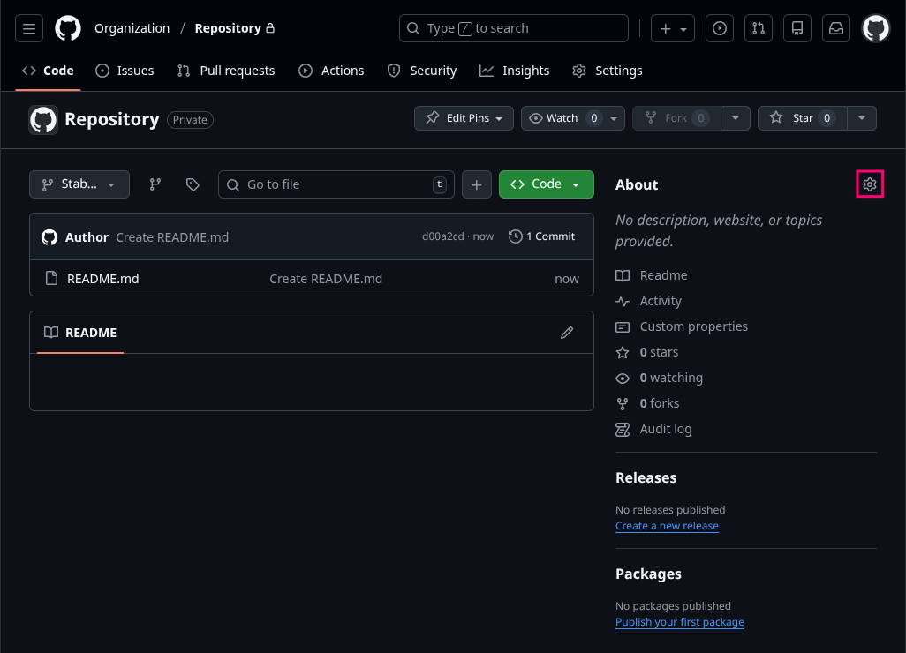
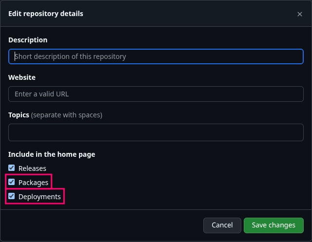
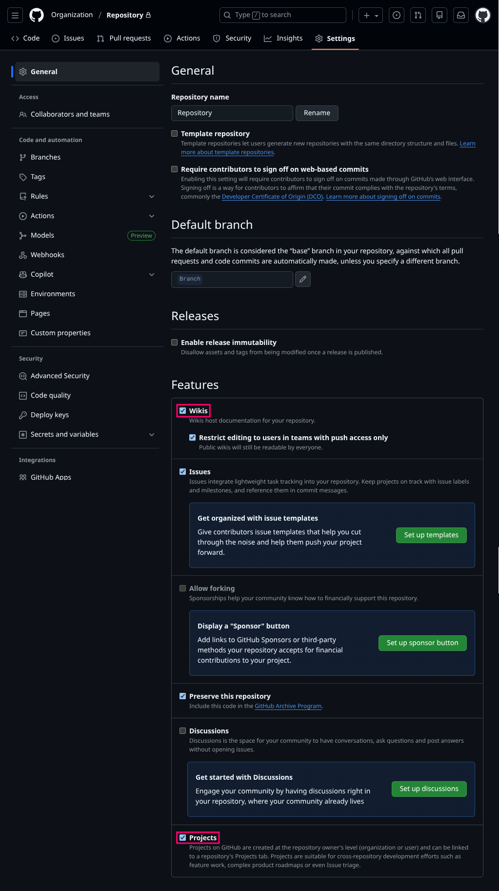
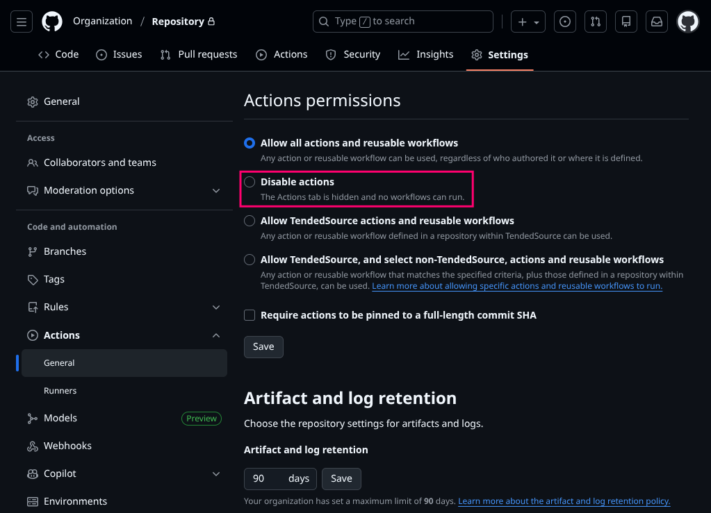

# Repository

How to tend to your repository.

 

## Intention

Disabling unused features in your repository removes  
visual / functional clutter and makes it easier for users  
to know what parts of GitHub you are actually utilizing.

 

## Overview

Here 'Overview' refers to the front page of a repository that is generated  
from the `README.md` file as well as files & metadata in your repository.

### Sidebar Settings

Open the sidebar settings via the gear icon on the right. 

 

Here you can disable the `Packages` & `Deployments` widgets.

### General Settings

Here you can disable the `Wiki`, `Projects` & `Discussions` tabs.

### Action Settings

Here you can disable the `Actions` ( Workflows ) tab.

